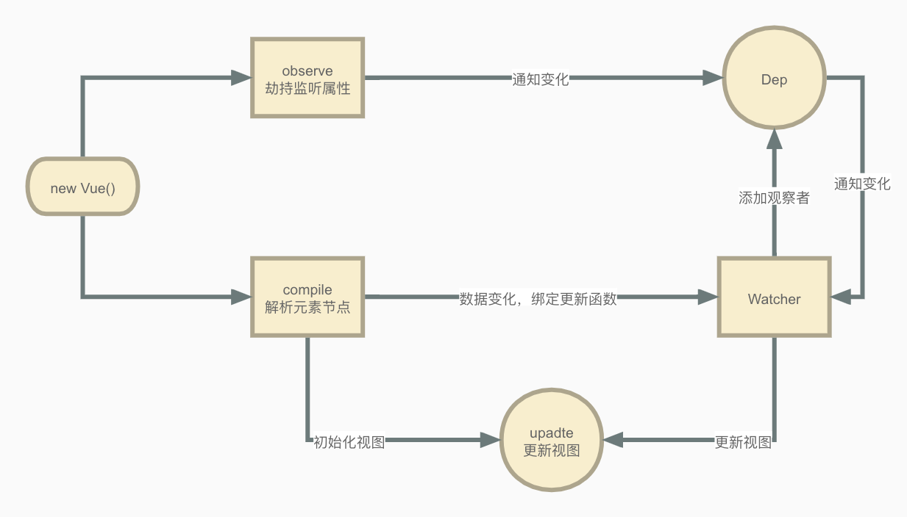

# 响应式原理

响应式是Vue最重要的特性，通过响应式在修改数据的时候更新视图来实现MVVM模式。在[Vue2文档](https://cn.vuejs.org/v2/guide/reactivity.html#如何追踪变化)里指出，Vue是使用[Object.defineProperty](https://developer.mozilla.org/zh-CN/docs/Web/JavaScript/Reference/Global_Objects/Object/defineProperty)将``data``选项里的``property``全部转为[getter/setter](https://developer.mozilla.org/zh-CN/docs/Web/JavaScript/Guide/Working_with_Objects#定义_getters_与_setters)来实现响应式。查阅[MDN文档](https://developer.mozilla.org/zh-CN/docs/Web/JavaScript/Reference/Global_Objects/Object/defineProperty#浏览器兼容性)也可以得知[Object.defineProperty](https://developer.mozilla.org/zh-CN/docs/Web/JavaScript/Reference/Global_Objects/Object/defineProperty)是不支持IE8以及更低版本的浏览器，因此Vue也不支持。

## 关于MVVM

### 什么是MVVM？

在使用Vue开发的过程中，最直观的感受就是修改``data``中的数据能实时更新到视图上。MVVM是Model-View-ViewModel的简写。ViewModel是连接View（视图）和Model（数据）的中间件，其实我认为觉得Model-ViewModel-View更合适。
以我个人的理解ViewModel实际上是给View和Model创建了一种双向数据绑定关系，既：

- ViewModel能够观察到Model的变化，并对视图对应的内容进行更新。
- ViewModel能够监听到View的变化，并能够通知数据发生变化。

### Vue是如何实现MVVM的？

实现MVVM通常有几种方式：发布订阅/观察者模式、脏值检查、数据劫持，以上几种方式都可以通过Google查阅资料去学习。这里我们主要学习的是Vue如何通过结合数据劫持和发布订阅模式来实现MVVM。Vue这部分特性是在[vue/src/core/observer/](https://github.com/vuejs/vue/tree/2.6/src/core/observer)中实现的，为了便于理解我们先不考虑对象、数组等情况，实现一个简单的MVVM数据绑定。

``` html
<html>

<body>
  <div id="app">
    <div>{{name}}</div>
  </div>
</body>

</html>
<script>
  /**
   * 劫持监听属性
   */
  function observe(data) {
    Object.keys(data).forEach(key => {
      let val = data[key]
      if (typeof val === 'object') {
        observe(val)
      }
      let dep = new Dep()
      // 对象属性订阅
      Object.defineProperty(data, key, {
        // 对象属性拦截
        get() {
          if (Dep.target) {
            // 添加订阅者
            dep.addSub(Dep.target)
          }
          return val
        },
        // 对象属性设置
        set(newVal) {
          if (newVal !== val) {
            val = newVal
            // 更新视图
            dep.notify()
          }
        }
      })
    })
  }

  /**
   * 观察者集合
   */
  class Dep {
    constructor() {
      this.subs = []
    }

    /**
     * 添加观察者
     * @param {Object} sub 观察者
     */
    addSub(sub) {
      this.subs.push(sub)
    }

    /**
     * 通知观察者
     */
    notify() {
      this.subs.forEach(sub => sub.update())
    }
  }

  /**
   * 观察者
   */
  class Watcher {

    /**
     * 构造函数
     * @param {Object} vm Vue实例
     * @param {String} exp 表达式
     * @param {Function} cb 回调函数
     */
    constructor(vm, exp, cb) {
      this.vm = vm
      this.exp = exp
      this.cb = cb
      this.value = this.get()
    }

    /**
     * 获取值
     * @return {Object} 值
     */
    get() {
      Dep.target = this
      let value = this.vm.data[this.exp]
      Dep.target = null
      return value
    }

    /**
     * 更新值
     */
    update() {
      let newVal = this.get()
      let oldVal = this.value
      if (newVal !== oldVal) {
        this.cb(newVal)
      }
    }
  }

  /**
   * 解析元素节点
   */
  function compile(el, vm) {
    let nodeList = el.childNodes
    // 遍历节点
    Array.from(nodeList).forEach(node => {
      let text = node.textContent
      if (/\{\{(.*)\}\}/.test(text)) {
        // 替换文本节点
        let [, exp] = text.match(/\{\{(.*)\}\}/)
        let val = vm.data[exp]
        node.textContent = val
        // 添加观察者
        new Watcher(vm, exp, function (newVal) {
          node.textContent = newVal
        })
      }
      // 递归子节点
      if (node.childNodes && node.childNodes.length) {
        compile(node, vm)
      }
    })
  }

  class Vue {
    constructor(options) {
      this.$el = document.getElementById(options.el)
      this.data = options.data
      observe(this.data)
      compile(this.$el, this)
      options.created()
    }
  }

  const vm = new Vue({
    el: 'app',
    data: {
      name: 'hello',
    },
    created() {
      setTimeout(() => {
        this.data.name = 'world'
      }, 1000)
    }
  })
</script>
```
### 工作流程

- Vue 构造函数，集中以下模块实现MVVM
- observe 通过Object.definePropty进行数据劫持
- Watcher 观察者，对数据进行观察以及保存数据修改需要触发的回调
- Dep 发布订阅者，添加观察者以及在数据发生改变的时候通知观察者
- compile 解析元素节点，将数据显示到HTML模版

